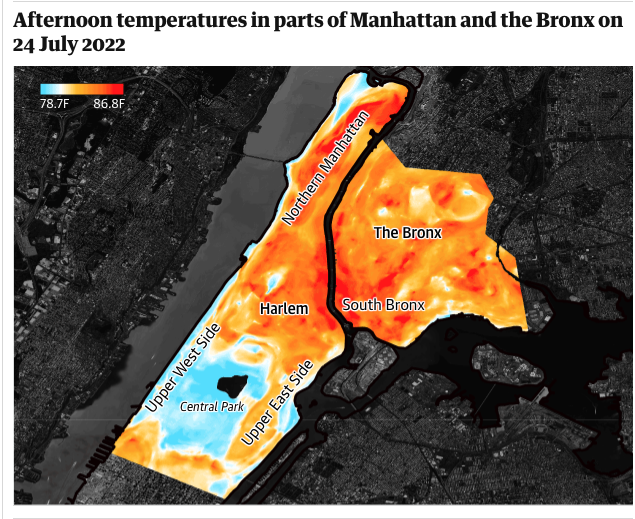
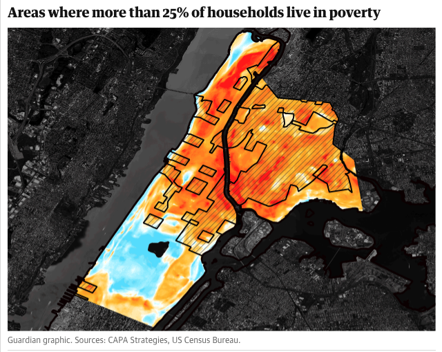

[Home Page](https://bbennyhb.github.io/Bryan-HB-Projects/) | [Visualizing Government Debt](visualizing-government-debt) | [Critique by Design](Critique-by-design) | [Columns](https://www.dailycal.org/users/profile/bryan%20hernandez%20benitez/) 

# Critique by Design 

## Step one: the visualization

When browsing different visualizations on Makeover Monday, I came across the following map that visualized how temperatures varied by location in New York. The article discussed how more affluent neighborhoods had access to bodies of water and green spaces, while poorer neighborhoods were landlocked and lacked adequate green spaces. Hence, the map highlighted how the more affluent neighborhoods of Manhattan had lower temperatures than their poor counterparts, despite being within miles of each other. I chose this visualization because I found it to be a great way to highlight how the built environment has the potential to perpetuate inequality even within a seemingly income-blind phenomenon such as temperature.

### _Heat Map Across Manhattan and the Bronx, NYC_

### _Poverty Boundaries Across Manhattan and the Bronx, NYC_

For the full article discussing the implications of temperature discrepancies and income, see the source below.

_Source: [The Guardian](https://www.theguardian.com/us-news/2022/sep/07/new-york-heat-deaths-map-inequality)_

## Step two: the critique

As I worked through some of the techniques for what differentiates a _good_ versus a _bad_ visualization, I found myself giving this visualization pretty good ratings. The realization that I may have chosen a visualization that was somewhat difficult to improve began to set in as I concluded the critique. A summary of my critique is as follows:

In hindsight, this may have been a poor choice in visualizations to critique given the scores above. Alas.

In reference to _"Afternoon temperatures in parts of Manhattan and the Bronx on 24 July 2022":_ 

What stands out immediately is its simplicity: We're instantly drawn to the map and are able to distinguish hotter sections from the cooler ones. Additionally, the clear labels help us differentiate the parts of NYC that the map is comparing, which is especially helpful for people such as myself who aren't familiar with the layout of the city. In order to improve the map I suppose I have to get picky. What didn't work was the choice to maintain the background layer as dark as they did.

In reference to _"Areas where more than 255 of households live in poverty":_

What doesn't work well on this map are the thick bold lines that distinguish areas with poverty. While I understand the intent to show a correlation between living in poverty and living in areas with higher temperatures, i think choosing a better way to section off those areas would've improved its score on its aesthetics. I think what's most significant about this map is its emotional aspect. It prompts the question about equality and fairness. 

When thinking about the primary audience for this visualization: 
I think both visualizations have capacity to inform both the general public and policymakers of NYC. A subset of the general public may also include local organizations dedicated to equity and mitigating the effects of climate change. Given that the visualizations were displayed in The Guardian, I think the visualizations were effective in reaching their intended audiences as well as other communities that find equitable urban design an important mission, which may spur support for more green spaces in areas with higher temperatures.

_Intended Recommendations to Improve Visualizations_ 
I think this method was successful and helped me realized I may have shot myself in the foot by choosing this visualization to critique. I don't think there's a measure that's missing entirely. However, I do think that a provision should be made to "Engagement." As we move toward more interactive visualizations, a sense of "interactiveness" should be included as part of the Engagement measure: Can the audience drill down on specific data points, regions, etc.? I think a heat map like the ones referenced would work best with interactiveness (e.g. being able to hover over Harlem, for example, and see the population and median annual income.)

In terms of recommendations, I think the second map ("Areas where more than 25%...") should've removed the underlying temperature data and solely focused on the poverty/income levels. As such, it would've given the visualization more real estate to include income levels, population density, etc. Given that these visualizations are found in succession, the audience may be able to link temperature data from the first visualization to income/poverty data on the second visualization. In sum, having the second visualization focus solely on the households that live in poverty instead of blending the temperature data may have made it more effective. 

As it stands, however, one change I'd make to the second visualization is to remove the thick bold lines of those areas and remove the lines that fill in those sections. 

## Step three: Sketch a solution

## Step four: Test the solution

_Before you conduct your interviews, prepare a simple script. Use this as a guide and as a way to take notes as you go forward. Come up with your own list of questions you want to ask for the selected visualization. 
Keep the questions broad so you can get the most value out of your feedback. Then, document answers to your questions here._

Questions to ask (modify these for your own interviews): 

- Can you tell me what you think this is?

- Can you describe to me what this is telling you?

- Is there anything you find surprising or confusing?

- Who do you think is the intended audience for this?

- Is there anything you would change or do differently?

Results: 

_Don't identify or share personally identifiable information (PII) about the people you spoke to._

| Question | Interview 1 | Interview 2 |
|----------|-------------|-------------|
|          |             |             |
|          |             |             |
|          |             |             |

Synthesis: 

_What patterns in the feedback emerge?  What did you learn from the feedback?  Based on this feedback, come up with what design changes you think might make the most sense in your final redesign._

## Step five: build the solution

_Include and describe your final solution here. It's also a good idea to summarize your thoughts on the process overall. 
When you're done with the assignment, this page should all the items mentioned in the assignment page on Canvas(a link or screenshot of the original data visualization, 
documentation explaining your process, a summary of your wireframes and user feedback, your final, redesigned data visualization, etc.)._
