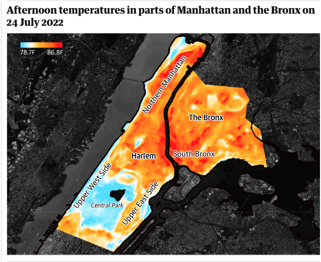

[Home Page](https://bbennyhb.github.io/Bryan-HB-Projects/) | [Visualizing Government Debt](visualizing-government-debt) | [Critique by Design](Critique-by-Design) | [Columns](https://www.dailycal.org/users/profile/bryan%20hernandez%20benitez/) 

# Critique by Design 

## Step one: the visualization

When browsing different visualizations on Makeover Monday, I came across the following map that visualized how temperatures varied by location in New York. The article discussed how more affluent neighborhoods had access to bodies of water and green spaces, while poorer neighborhoods were landlocked and lacked adequate green spaces. Hence, the map highlighted how the more affluent neighborhoods of Manhattan had lower temperatures than their poor counterparts, despite being within miles of each other. I chose this visualization because I found it to be a great way to highlight how the built environment has the potential to perpetuate inequality even within a seemingly income-blind phenomenon such as temperature.

### _Heat Map Across Manhattan and the Bronx, NYC_

### _Poverty Boundaries Across Manhattan and the Bronx, NYC_

For the full article discussing the implications of temperature discrepancies and income, see the source below.

_Source: [The Guardian](https://www.theguardian.com/us-news/2022/sep/07/new-york-heat-deaths-map-inequality)_

## Step two: the critique

As I worked through some of the techniques for what differentiates a _good_ versus a _bad_ visualization, I found myself giving this visualization pretty good ratings. The realization that I may have chosen a visualization that was somewhat difficult to improve began to set in as I concluded the critique. A summary of my critique is as follows:

In hindsight, this may have been a poor choice in visualizations to critique given the scores above. Alas.

In reference to _"Afternoon temperatures in parts of Manhattan and the Bronx on 24 July 2022":_ 

What stands out immediately is its simplicity: We're instantly drawn to the map and are able to distinguish hotter sections from the cooler ones. Additionally, the clear labels help us differentiate the parts of NYC that the map is comparing, which is especially helpful for people such as myself who aren't familiar with the layout of the city. In order to improve the map I suppose I have to get picky. What didn't work was the choice to maintain the background layer as dark as they did.

In reference to _"Areas where more than 255 of households live in poverty":_

What doesn't work well on this map are the thick bold lines that distinguish areas with poverty. While I understand the intent to show a correlation between living in poverty and living in areas with higher temperatures, I think choosing a better way to section off those areas would've improved its score on its aesthetics. I think what's most significant about this map is its emotional aspect. It prompts the question about equality and fairness. 

When thinking about the primary audience for this visualization: 
I think both visualizations have capacity to inform both the general public and policymakers of NYC. A subset of the general public may also include local organizations dedicated to equity and mitigating the effects of climate change. Given that the visualizations were displayed in The Guardian, I think the visualizations were effective in reaching their intended audiences as well as other communities that find equitable urban design an important mission, which may spur support for more green spaces in areas with higher temperatures.

_Intended Recommendations to Improve Visualizations:_ 

I think this method was successful and helped me realize I may have shot myself in the foot by choosing this visualization to critique. I don't think there's a measure that's missing entirely. However, I do think that a provision should be made for "Engagement." As we move toward more interactive visualizations, a sense of "interactiveness" should be included as part of the Engagement measure: Can the audience drill down on specific data points, regions, etc.? I think a heat map like the ones referenced would work best with interactiveness (e.g. being able to hover over Harlem, for example, and see the population and median annual income.)

In terms of recommendations, I think the second map ("Areas where more than 25%...") should've removed the underlying temperature data and solely focused on the poverty/income levels. As such, it would've given the visualization more real estate to include income levels, population density, etc. Given that these visualizations are found in succession, the audience may be able to link temperature data from the first visualization to income/poverty data on the second visualization. In sum, having the second visualization focus solely on the households that live in poverty instead of blending the temperature data may have made it more effective. 

As it stands, however, one change I'd make to the second visualization is to remove the thick bold lines of those areas and remove the lines that fill in those sections. 

## Step three: Sketch a solution

The realization I had earlier when I was critiquing the design – realizing that I had chosen a visualization that would be hard to improve — suddenly became a self-deprecating battle of cleaning data and trying to manually code locations that Tableau was not recognizing to be boroughs of New York. It was at this point in the assignment that I, for lack of a better phrase, hit a brick wall. The dataset I had downloaded, the one associated with the article, was 1) huge with more than two million rows, and 2) encoded with acronyms that Tableau did not recognize. As such, the intended heat map that I wanted to create, initially, became just points on a greyed-out layer. I wanted to cry. 

As such, I couldn't bring myself to publish those on Tableau Public—an embarrassment to the pride I take in thinking I know how to make something look pretty. Said sketches are found below.

#### Sketch One

 

#### Sketch Two

 

## Step four: Test the solution

I understood going into this stage that my visualizations were utterly malnourished. The simple escape would've been to return to stage one and choose a better visualization with easier-to-work-with data, but I figured I'd see it through and do what I could. I conducted two interviews following the questions outlined below. Interviewee A was a female in her early twenties and a graduate student. Interviewee B was a female in her mid-twenties and a graduate student as well. Interviewee A was asked to provide feedback on Sketch One, whereas Interviewee B was asked to provide feedback on Sketch Two.

Given that both interviewees were graduate students in similar graduate programs and close in age, I recognize that the results of the interviews did not particularly follow the results we'd see from random sampling. Alas, part two.

- Can you tell me what you think this is?

- Can you describe to me what this is telling you?

- Is there anything you find surprising or confusing?

- Who do you think is the intended audience for this?

- Is there anything you would change or do differently?

Results: 

### Interviewee A: Sketch One

_Can you tell me what you think this is?_

Four boroughs in New York, three months, and values for each neighborhood.

_Can you describe to me what this is telling you?_

I'm assuming it's comparing values for each neighborhood in each borough in each borough per month in 2018.

_Is there anything you find surprising or confusing?_

If you hadn't told me that the values were temperature measurements, I wouldn't have known what they were.

_Who do you think is the intended audience for this?_

People who live in New York. Perhaps each neighborhood, maybe the government

_Is there anything you would change or do differently?_ 

Change the colors, maybe make warm instead of cool colors like blue. Make it _stepped_ so it's easier to differentiate the temperatures in the table.

### Interviewee B: Sketch Two

_Can you tell me what you think this is?_

Looks like a trend of temperature from June to August in New York.

_Can you describe to me what this is telling you?_

Similar temperatures in Brooklyn and Manhattan?

_Is there anything you find surprising or confusing?_

It's hard to see the difference in temperatures because the lines are so close together, so they look the same.

_Who do you think is the intended audience for this?_

People in New York City, residents of Manhattan and Brooklyn. Could also be something you show to climate change activists.

_Is there anything you would change or do differently?_ 

The x-axis first of all. It's Summer, so I don't see why the x-axis couldn't start at 60. 

Synthesis: 

_What patterns in the feedback emerge?  What did you learn from the feedback?  Based on this feedback, come up with what design changes you think might make the most sense in your final redesign._

The patterns that emerged centered around, essentially, not knowing what the visualization was showing to begin with. While I had intended to map temperature differences across boroughs in New York, I found myself having to resort to simple line graphs and highlight tables to visualize _something_ with the data that I had. I learned that despite bad data that limited my options on available visualizations, I still had things like the Title and Subtitle and adjusting axes that could make my visualizations clearer and, frankly, not so shit. Based on this feedback, I got back to work and did what I could with the ingredients I had—and, of course, the very direct input from interviews that emphasized a "What are we looking at here?" emotion. 

## Step five: build the solution

_Include and describe your final solution here. It's also a good idea to summarize your thoughts on the process overall. 
When you're done with the assignment, this page should all the items mentioned in the assignment page on Canvas(a link or screenshot of the original data visualization, 
documentation explaining your process, a summary of your wireframes and user feedback, your final, redesigned data visualization, etc.)._
