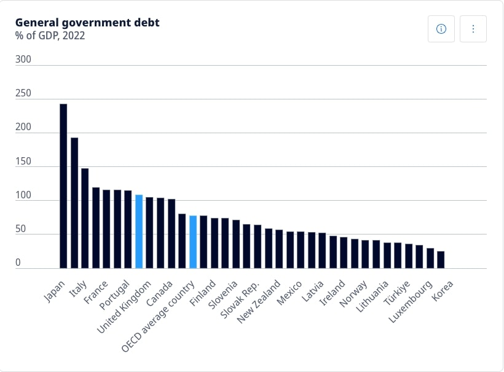

[Home Page](https://bbennyhb.github.io/Bryan-HB-Projects/) | [Visualizing Government Debt](visualizing-government-debt) | [Columns](https://www.dailycal.org/users/profile/bryan%20hernandez%20benitez/) 

# Visualizing Government Debt Across Countries

The following visualizations track government debt.

## Part one: Working with web-based visualization tools and data

Original image from the OCED platform. 

 

## Working with Tableau

Heatmap showing GDP to Debt Ratio across years.

<noscript></noscript><object class='tableauViz'  style='display:none;'><param name='host_url' value='https%3A%2F%2Fpublic.tableau.com%2F' /> <param name='embed_code_version' value='3' /> <param name='site_root' value='' /><param name='name' value='HeatmapGDPtoDebt&#47;HeatmapGDPtoDebt' /><param name='tabs' value='no' /><param name='toolbar' value='yes' /><param name='static_image' value='https:&#47;&#47;public.tableau.com&#47;static&#47;images&#47;He&#47;HeatmapGDPtoDebt&#47;HeatmapGDPtoDebt&#47;1.png' /> <param name='animate_transition' value='yes' /><param name='display_static_image' value='yes' /><param name='display_spinner' value='yes' /><param name='display_overlay' value='yes' /><param name='display_count' value='yes' /><param name='language' value='en-US' /></object>
                

## Part three: create your own visualization

Visualization 1 was taken directly from the Organization for Economic Co-Operation and Development (OCED). While this visualization provides a decent overview of how countries compare to one another, it doesn't provide viewers with direct percentages by country. In contrast, the heatmap (visualization 2) does a much better job of giving side-by-side country comparisons that allow us to compare direct ratios while maintaining an interactive aspect—as shown with the year-by-year changes. 

While these initial visualizations hold well in providing information, they lack in guiding decision-makers. In essence, there's no "so what?" aspect to visualizations 1 and 2. As such, the following visualization hones in on data retrieved from Canvas. While more countries and their respective GDP-to-Debt ratios were included in the dataset, I felt it would be more impactful to draw attention to a subset of that data, one that focuses on member nations of the European Union. By creating a map of these EU members, we're better able to understand how a key region of the world is doing. Furthermore, the visualization uses external research obtained from the World Bank (2010) to qualify a "good" versus "bad" ratio. 

As such, this visualization uses diverging colors (grey and red) in which countries at or under a good ratio threshold (77.1 percent) are shaded in grey, whereas countries above that threshold are marked in red. More information and analysis can be found in the visualization below.

<noscript></noscript><object class='tableauViz'  style='display:none;'><param name='host_url' value='https%3A%2F%2Fpublic.tableau.com%2F' /> <param name='embed_code_version' value='3' /> <param name='site_root' value='' /><param name='name' value='EUMemberStatesDebttoGDP&#47;EUMemberStates2017' /><param name='tabs' value='no' /><param name='toolbar' value='yes' /><param name='static_image' value='https:&#47;&#47;public.tableau.com&#47;static&#47;images&#47;EU&#47;EUMemberStatesDebttoGDP&#47;EUMemberStates2017&#47;1.png' /> <param name='animate_transition' value='yes' /><param name='display_static_image' value='yes' /><param name='display_spinner' value='yes' /><param name='display_overlay' value='yes' /><param name='display_count' value='yes' /><param name='language' value='en-US' /></object>
                

_Sources: Organization for Economic Co-Operation and Development, World Bank (2010)_

